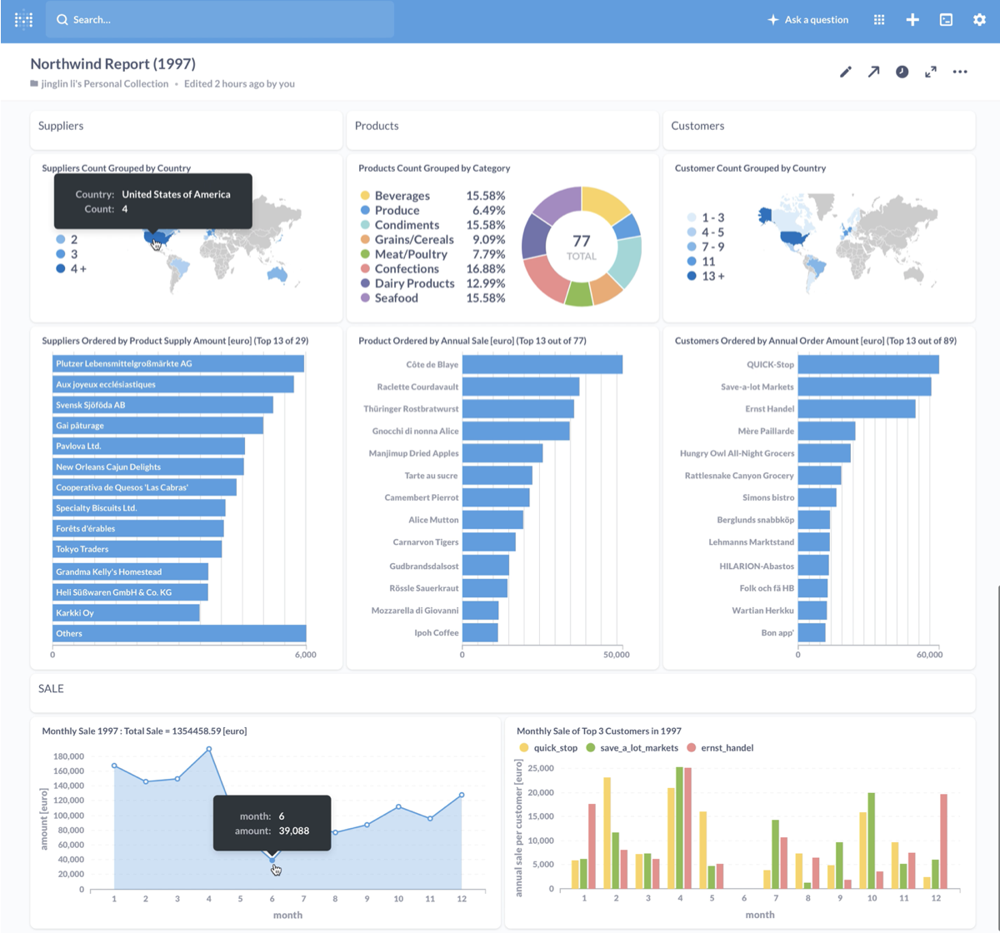

# Northwind Dashboard
use Metabase on AWS-EC2 to make dashboard of data in PostgreSQL database on AWS-RDS

## Goal :
use Metabase on AWS-EC2 to make dashboard of data in PostgreSQL database on AWS-RDS

## Procedure :
- put northwind postgresql database on AWS cloud database RDS
- run metabase on AWS EC2 instance
- connect postgresql database on RDS to AWS EC2
- run queries and create dashbord with metabase

## Results : 

